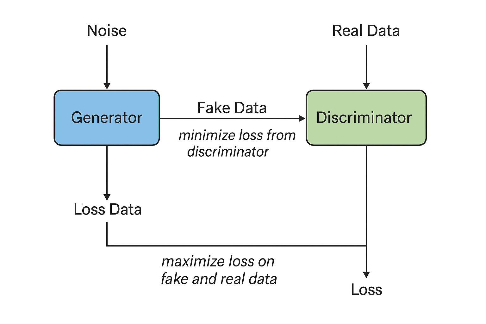

# CS5720: Neural Networks and Deep Learning  
### Home Assignment 4 – Summer 2025  
**University of Central Missouri**  
**Student Name:** Naidu Gudivada
**Student ID:** 700773264
----------------------------------------------------------------------------
## 🔍 Assignment Overview

This assignment covers chapters 11 and 12 and explores key concepts in Generative Adversarial Networks (GANs), ethical implications of AI, data poisoning attacks, and fairness auditing using bias detection tools.
-----------------------------------------------------------------------------

1. GAN Architecture

Generative Adversarial Network (GAN) consists of:
Generator (G): Produces fake data from noise.
Discriminator (D): Distinguishes between real and fake data.
Adversarial Process
Generator learns to generate realistic data to fool the discriminator.
Discriminator learns to distinguish real from fake.
Both networks improve through a minimax game.
Diagram:

Noise → Generator → Fake Data → Discriminator
Real Data → Discriminator
Feedback (loss) flows back to both networks to improve performance.
--------------------------------------------------------------------------------------------
2. Ethics and AI Harm
Chosen Harm: Allocational Harm
Example:
A hiring AI favors male candidates based on historical data, denying equally qualified women.
Mitigation Strategies:
Audit training data for representation bias.
Use fairness-aware training methods like adversarial debiasing or re-weighting.
--------------------------------------------------------------------------------------------
3. Programming Task – Basic GAN Implementation
Objective: Generate MNIST digit images using a GAN.
Implementation Details:
Generator and Discriminator created using PyTorch/TensorFlow.
Alternating training updates.
Results saved at Epochs 0, 50, and 100.
Deliverables:
Images: epoch_0.png, epoch_50.png, epoch_100.png
Loss plots of Generator and Discriminator over epochs.
---------------------------------------------------------------------------------------------
4. Programming Task – Data Poisoning Simulation
Objective: Simulate poisoning a sentiment classifier.
Steps:
Train a sentiment classifier on movie reviews.
Flip labels for phrases mentioning "UC Berkeley."
Compare model performance pre- and post-poisoning.
Deliverables:
Accuracy graphs
Confusion matrices
Analysis of misclassified examples
------------------------------------------------------------------------------------------
5. Legal and Ethical Implications of GenAI
Concerns:
Memorizing Private Data: GPT-2-like models leaking names or sensitive information.
Generating Copyrighted Content: AI models recreating text from copyrighted works.
Opinion:
AI should not train on private or copyrighted data unless:
User consent is obtained.
Licensing terms allow it.
This protects both privacy and intellectual property.
--------------------------------------------------------------------------------------------
6. Bias & Fairness Tools – Aequitas
Metric: False Negative Rate (FNR) Parity
Measures: Equality in false negatives across demographic groups.
Importance:
Prevents systematic denial of opportunities (e.g., loans, jobs).
How Models Fail:
Higher FNR in underrepresented groups leads to discrimination.
Mitigation:
Balance data
Use fairness auditing tools like Aequitas